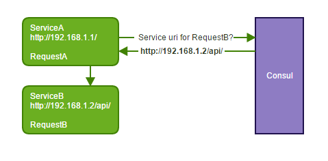
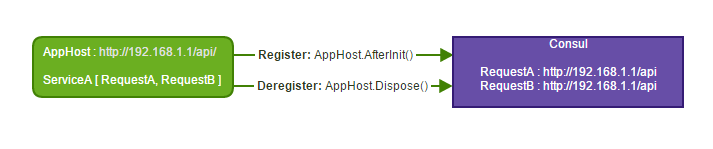
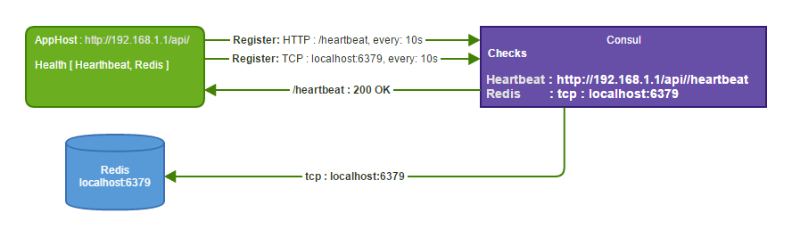
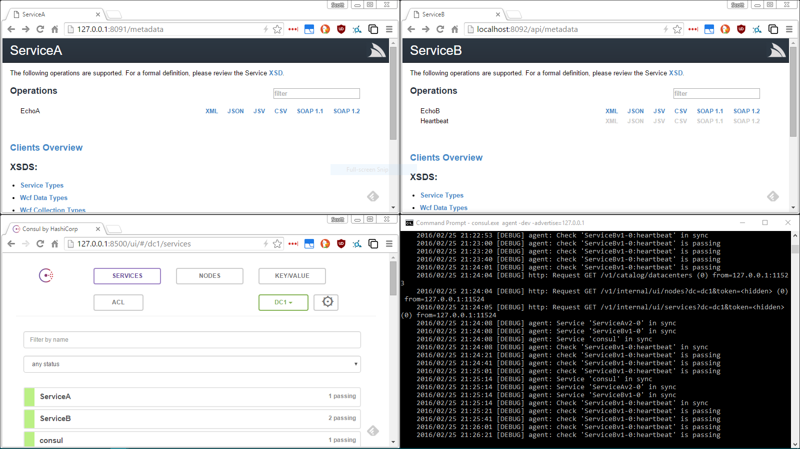

# ServiceStack.Discovery.Consul 
[](https://ci.appveyor.com/project/wwwlicious/servicestack-discovery-consul)
[](https://badge.fury.io/nu/ServiceStack.Discovery.Consul)

A plugin for [ServiceStack](https://servicestack.net/) that provides 
transparent [client service discovery](http://microservices.io/patterns/client-side-discovery.html) 
using [Consul.io](http://consul.io) as a [Service Registry](http://microservices.io/patterns/service-registry.html)

This enables distributed servicestack instances to call one another, 
without either knowing where the other is, based solely on a 
copy of the .Net CLR request type. 

Your services will not need to take **any dependencies** on each other 
and as you deploy updates to your services they will **automatically be registered** 
and used without reconfiguing the existing services.

The automatic and customisable health checks for each service will 
also ensure that **failing services will not be used**, or if you 
run multiple instances of a service, only the healthy and **most responsive** 
service will be returned. 



## Requirements

A consul agent must be running on the same machine as the AppHost.

## Quick Start

Install the package [https://www.nuget.org/packages/ServiceStack.Discovery.Consul](https://www.nuget.org/packages/ServiceStack.Discovery.Consul/)
```bash
PM> Install-Package ServiceStack.Discovery.Consul
```
Add the following to your `AppHost.Configure` method

```csharp
public override void Configure(Container container)
{
    SetConfig(new HostConfig
    {
        // the url:port that other services will use to access this one
        WebHostUrl = "http://api.acme.com:1234",

        // optional
        ApiVersion = "2.0",             
        HandlerFactoryPath = "/api/"
    });

    // Register the plugin, that's it!
    Plugins.Add(new ConsulFeature());
}
```
To call external services, you just call the Gateway and let it handle the routing for you.
```csharp
public class MyService : Service
{
    public void Any(RequestDTO dto)
    {
        // The gateway will automatically route external requests to the correct service
        var internalCall = Gateway.Send(new InternalDTO { ... });
        var externalCall = Gateway.Send(new ExternalDTO { ... });
    }
}
```

It really is that simple!

## Running your services

Before you start your services, you'll need to [download consul](https://www.consul.io/) and start the agent running on your machine.

### Using the binary

The following will create an in-memory instance which is useful for testing

```bash
consul.exe agent -dev -advertise="127.0.0.1"
```
You should now be able see the [Consul Agent WebUI](http://127.0.0.1:8500/ui) link appear under **Plugins** on the metadata page.

### Using the offical docker image

```bash
docker pull consul
docker run -dp 8500:8500/tcp --name=dev-consul consul agent -dev -ui -client 0.0.0.0
```
This will create an in-memory instance using the official docker image


## Under the covers...

### Automatic Service Registration



Once you have added the plugin to your ServiceStack AppHost and 
started it up, it will [self-register](http://microservices.io/patterns/self-registration.html):

* AppHost.AfterInit - Registers the service and it's operations in the service registry.
* AppHost.OnDispose - Deregisters the service when the AppHost is shutdown.

### Health checks



Each service can have any number of health checks. These checks are run by Consul and allow service discovery to filter out failing instances of your services.

By default the plugin creates 2 health checks

1. Heartbeat : Creates an endpoint in your service [http://locahost:1234/reply/json/heartbeat](http://locahost:1234/reply/json/heartbeat) that expects a 200 response
2. If Redis has been configured in the AppHost, it will check Redis is responding

You can turn off the default health checks by setting the following property:

```csharp
new ConsulFeature(settings => { settings.IncludeDefaultServiceHealth = false; });
```

### Custom health checks

You can add your own health checks in one of two ways

#### 1. Define your own health check delegate. 

```csharp
new ConsulFeature(settings =>
{
    settings.AddServiceCheck(host =>
    {
        // your code for checking service health
        if (...failing check)
            return new HealthCheck(ServiceHealth.Critical, "Out of disk space");
        if (...warning check)
            return new HealthCheck(ServiceHealth.Warning, "Query times are slow than expected");
            
        ...ok check 
        return new HealthCheck(ServiceHealth.Ok, "working normally");
    },
    intervalInSeconds: 60 // default check once per minute
    );
});
```
_If an exception is thrown from this
check, the healthcheck will return **Critical** to consul along with the exception_

#### 2. Specifying HTTP or TCP endpoints

```csharp
new ConsulFeature(settings =>
{
    settings.AddServiceCheck(new ConsulRegisterCheck("httpcheck")
    {
        HTTP = "http://myservice/custom/healthcheck",
        IntervalInSeconds = 60
    });
    settings.AddServiceCheck(new ConsulRegisterCheck("tcpcheck")
    {
        TCP = "localhost:1234",
        IntervalInSeconds = 60
    });
});
```
_http checks must be GET and the health check expects a 200 http status code_

_tcp checks expect an ACK response_

### Discovery

#### Excluding RequestDTO's

If there are types that you want to exclude from being registered 
for discovery by other services, you can use one of the following options:

The `ExcludeAttribute` : `Feature.Metadata` or `Feature.ServiceDiscovery` are not registered

```csharp
[Exclude(Feature.ServiceDiscovery | Feature.Metadata)]
public class MyInternalDto { ... }
```

The `RestrictAttribute`. Any type that does not allow `RestrictAttribute.External` will be excluded.
See the [documentation](https://github.com/ServiceStack/ServiceStack/wiki/Restricting-Services) for more details

```csharp
[Restrict(RequestAttributes.External)]
public class MyInternalDto { ... }
```

#### Customisable discovery

The default discovery mechanism uses the ServiceStack request types to resolve 
all of the services capable of processing the request. This means that you should 
**always use unique request names** across all your services for each of your RequestDTO's
To override the default behaviour, you can implement your own 
`IDiscoveryRequestTypeResolver`

```csharp
new ConsulFeature(settings =>
{
    settings.AddDiscoveryTypeResolver(new CustomDiscoveryRequestTypeResolver());
});
```
```csharp
public class CustomDiscoveryRequestTypeResolver : IDiscoveryRequestTypeResolver
{
    public string[] GetRequestTypes(IAppHost host)
    {
        // register dto's for reverse lookup below ...
    }

    public string ResolveBaseUri(object dto)
    {
        // reverse lookup service base uri from dto ...
    }
}
```

### Configuring the external Gateway

By default a `JsonServiceClient` is used for all external `Gateway` requests. 
To change this default, or just to add additional client configuration, 
you can set the following setting: 

```csharp
new ConsulFeature(settings =>
{
    settings.SetDefaultGateway(baseUri => new JsvServiceClient(baseUri) { UserName = "custom" });
});
``` 

You can then continue to use the Gateway as normal but any external call will now use your preferred `IServiceGateway` 

```csharp
public class EchoService : Service
{
    public void Any(int num)
    {
        // this will use the JsvServiceClient to send the external DTO
        var remoteResponse = Gateway.Send(new ExternalDTO());
    }
}
```

### Tags

you can add your own custom tags to register with consul. This can be useful when you override the
default 'IDiscoveryTypeResolver' or want to register different regions or environments for services

```csharp
new ConsulFeature(settings => { settings.AddTags("region-us-east", "region-europe-west", "region-aus-east"); });
```

### Example

The following shows the services registered with consul and passing health 
checks and the services running on different IP:Port/Paths




